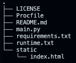

# Monitoring machine learning models in production

In this tutorial, we will learn how to monitor machine learning models in production using an open-source framework called [Evidently](https://github.com/evidentlyai/evidently). In their own words - *"Evidently helps analyze and track data and ML model quality throughout the model lifecycle. You can think of it as an evaluation layer that fits into the existing ML stack."*

Evidently helps in generating:
1. **Interactive visual reports** - Evidently has the ability to generate interactive dashboards (.html files) from the pandas dataframe or the .csv files. In general, 7 pre-built reports are available.
2. **Data and ML model profiling** - JSON profiles that can be integrated with tools like Mlflow and Airflow.
3. **Real time monitoring** - Evidently's monitors collect data and model metrics from a deployed ML service. This functionality can be used to build live dashboards.

Checkout [this README](https://github.com/evidentlyai/evidently/blob/main/README.md) to learn more about Evidently.

### Model Scoring and Model Drift

We will be using the [UCI Bike Sharing Dataset](https://archive.ics.uci.edu/ml/datasets/bike+sharing+dataset) and work with a Regression model deployed on Heroku. Our focus is going to be on **data drift** which is a type of model drift. Evidently will help us with the following
1. **Model Quality** - Evaluate model quality using performance metrics and track when/where the model fails.
2. **Data Drift** - Run statistical tests to compare the input feature distribution and visualize the data drift (if any).
3. **Target Drift** - Assess how model predictions and target behavior change over time.
4. **Data Quality** - Get data health and dig deeper into feature exploration.

### How to check drift within a production model?

**Prerequisites** - 
1. Ensure that you have a Github and Heroku account.
2. Clone this repository - 
```bash
git clone https://github.com/udacity/cd0583-model-scoring-and-drift-using-evidently.git
```

**Repository Structure**


- `static` folder: contains the .html files generated in Heroku.
- `Procfile`: to get the necessary commands working in Heroku.
- `main.py`: Python file containing the code to train the model and check the drift.
- `requirements.txt`: contains the libraries to be installed in Heroku
- `runtime.txt`: contains the python runtime to be installed in Heroku

The `main.py` file works on monitoring bike demand data. It involves the following steps:
1. Read the data into a pandas dataframe.
2. Build and train a regression model.
3. Use **Evidently** to evaluate model performance. To that end we first implement [column mapping](https://github.com/evidentlyai/evidently/blob/main/docs/book/dashboards/column_mapping.md) as shown below:
    ```python
    column_mapping = ColumnMapping()

    column_mapping.target = target
    column_mapping.prediction = prediction
    column_mapping.numerical_features = numerical_features
    column_mapping.categorical_features = categorical_features
    ```
4. The following code helps in getting the model performance and building a dashboard.
    ```python
    regression_perfomance_dashboard = Dashboard(tabs=[RegressionPerformanceTab()])
    regression_perfomance_dashboard.calculate(reference, 
                                            None,  
                                            column_mapping=column_mapping)
    regression_perfomance_dashboard.save("./static/index.html")
    ```
    >Note: We have implemented the code to evaluate performance for Week 1, 2, and 3.
5. Data Drift is calculated using the code below:
    ```python
    column_mapping = ColumnMapping()

    column_mapping.numerical_features = numerical_features

    data_drift_dashboard = Dashboard(tabs=[DataDriftTab()])
    data_drift_dashboard.calculate(reference, 
                                    current.loc['2011-01-29 00:00:00':'2011-02-07 23:00:00'], 
                                    column_mapping=column_mapping)

    data_drift_dashboard.save("./static/data_drift_dashboard_after_week1.html")
    ```
    >Note: We have implemented the code to calculate data drift for Week 1 and 2.

### Deploying on Heroku, evaluating model performance, and calculating data drift

Follow the steps mentioned below:
